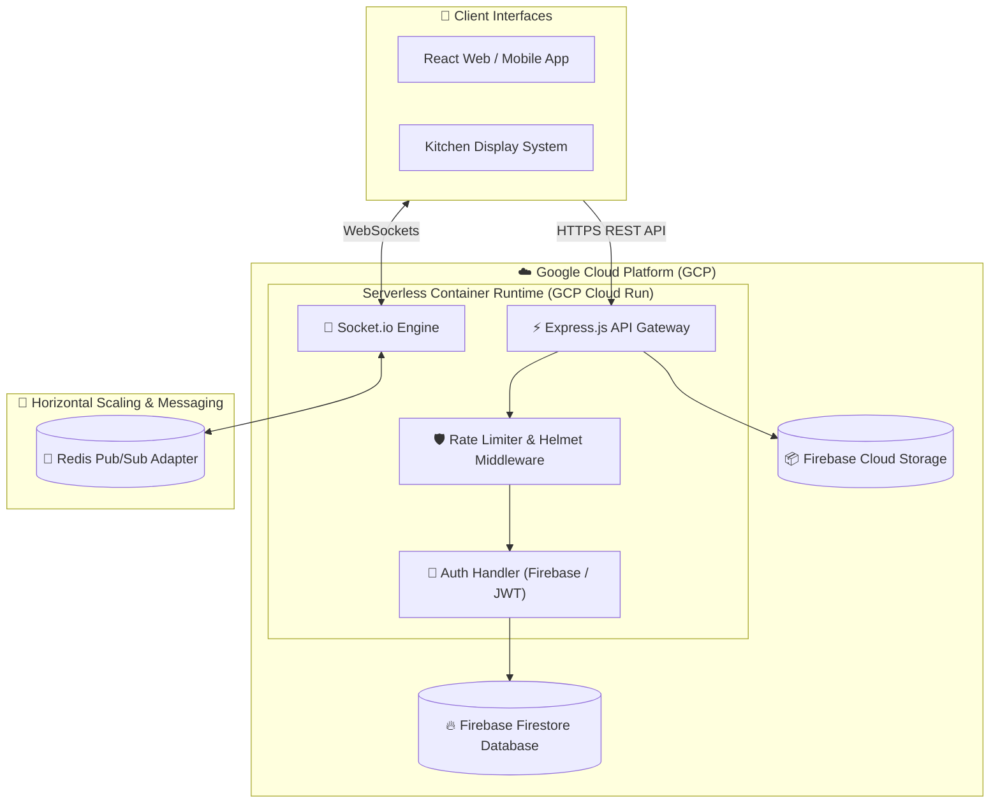

# 🍽️ Smart Waiter - Real-Time Multi-Tenant POS & Order Management Infrastructure

🌐 **Live API Engine:** [https://cloudyra-server-373117821334.asia-southeast1.run.app](https://cloudyra-server-373117821334.asia-southeast1.run.app)

---

## 📌 Executive Overview

**Smart Waiter** is an enterprise-grade backend microservice architecture engineered to streamline multi-tenant restaurant operations, dynamic digital menu management, and low-latency order dispatching. Built on **Node.js, Express, and Firebase Firestore**, the engine manages high-concurrency order placement, instant bi-directional event broadcasts, transactional payment processing, and automated background tasks.

Architected specifically for production deployment on **Google Cloud Platform (GCP) Cloud Run**, the infrastructure utilizes optimized multi-stage Docker containers to achieve near-instant cold starts, high availability, and auto-scaling performance under heavy load.

---

## 🏗️ System Architecture Flow

---

## ✨ Core Key Capabilities

- **🛍️ Order Lifecycle Engine:** Handles end-to-end order state machines (`Pending` ➔ `Preparing` ➔ `Ready` ➔ `Completed`), table assignments, and multi-tenant isolation.
- **⚡ Low-Latency Event Sync:** Instant bi-directional WebSocket streaming via Socket.io ensures real-time updates across Kitchen Display Systems (KDS), waiter tablets, and admin portals.
- **🔥 Scalable NoSQL Data Pipeline:** Optimized Firestore Admin SDK integration with transactional batch writes, atomic operations, and custom index configurations.
- **🐳 Multi-Stage Docker Containerization:** Minimal footprint runtime image based on `node:20-slim`, fine-tuned for fast serverless container execution on GCP.
- **🔒 Hardened Network Security:** Equipped with Helmet HTTP security headers, dynamic CORS policy management, IP rate-limiting, and bearer token JWT authentication.
- **📁 Secure File Stream Pipeline:** Memory-buffered binary file uploads using `multer` with strict MIME-type and payload size validation for digital menu management.
- **🔄 Distributed Pub/Sub Scaling:** Configured with `@socket.io/redis-adapter` for smooth multi-instance horizontal scaling without session loss.
- **📧 Automated Webhooks & Notifications:** Integrated LemonSqueezy payment webhooks and automated email dispatches for critical notifications.

---

## 🛠️ Comprehensive Tech Stack

| Layer | Technology | Engineering Role |
| :--- | :--- | :--- |
| **Runtime Environment** | Node.js (v20) | Asynchronous event-driven JavaScript backend |
| **API Framework** | Express.js | Modular RESTful route handling & middleware orchestration |
| **Database Systems** | Firebase Firestore | Multi-tenant NoSQL document repository |
| **Identity & Security** | Firebase Admin / JWT | Role-Based Access Control (RBAC) & session validation |
| **Realtime Engine** | Socket.io | Persistent WebSocket communication layer |
| **Container Engine** | Docker | Immutable multi-stage container builds |
| **Hosting Platform** | GCP Cloud Run | Fully managed, auto-scaling serverless infrastructure |
| **Middlewares** | Helmet / Express-Rate-Limit | Hardened security headers and DDoS mitigation |

---

## 🔒 Proprietary IP & Access Request Policy

Smart Waiter is a **closed-source proprietary platform**. Core business algorithms, database schemas, and private infrastructure configurations are securely isolated in a private repository.

### 🌐 System Access & Technical Inquiries
For live API access keys, architecture walkthroughs, or commercial deployment inquiries, please contact:

- **Developer:** Kalana Paragoda
